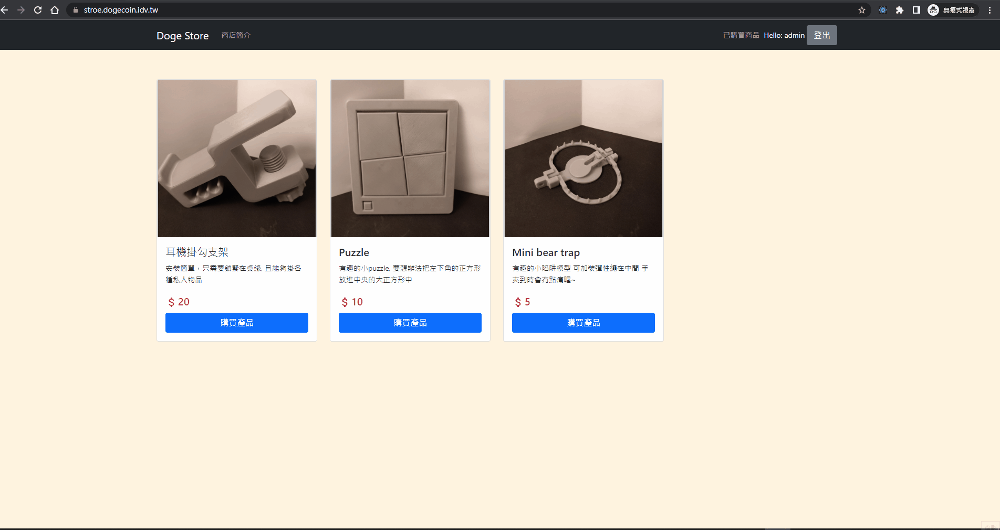

# Doge Store

Website: 遷移網頁中

## Test coverage

## 介紹
這是一個購買3D列印模型的購物網站的後端server

前端在 [doge_store_front](https://github.com/franky3020/doge_store_front)

目前有 [會員登入, 會員購買模型, 後台管理介面]

### 使用者操作
* 註冊 > 查看模型 > 購買模型 >  下載模型 > 查看已購買模型 > 登出

### 管理者操作
* ˋ上傳新模型 > 上傳模型圖片 > 上傳模型zip檔 > 測試下載 > 刪除模型

## 主要技術
1. 使用 Node.js + Express 打造 RESTful API
2. 使用 MySQL 為資料庫 
3. 使用 JWT 驗證使用者
4. 使用 Jest 框架實作單元測試
5. 使用 Docker + PM2 部屬 server

## 即將更新的功能
前端將會顯示 3D 模型, 使用 [Three.js](https://threejs.org/) 的3D引擎實作

[Demo](http://dogecoin.idv.tw:50020/)

